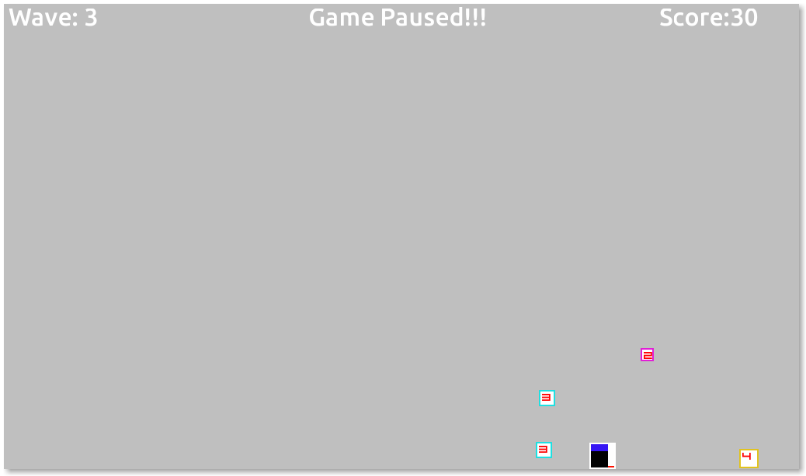

revenge-of-the-PNGs
===================

2D/LibGDX game
The .pngs have revolted! Fight off hordes of invading sprites in progressively difficult waves!

Controls: WASD to shoot, and arrow keys for movement. Space bar toggles rectangle drawing for debugging purposes

To play, download Revenge_of_the_PNGs.jar in the root directory or simply click [here](http://users.encs.concordia.ca/~m_mowbr/revenge_of_the_PNGs/)

Freshly ported to LibGDX from MonoGame.

TODO:

	-Enemy movement at times jerky
	-Add sounds

	-Reinstate score
	-Slight code cleanup/refactoring, including improved commenting and performance optimizations(off-screen elements)
	-Improve projectile hit detection
	-Menu/Pause
	-Grenades/Laser beam weapons
	-New opponents with different methods of movement towards player
	-Bosses
	-Other game mechanics
	-Mouse input for shooting
	-Smoother player movement

Screenshots:

